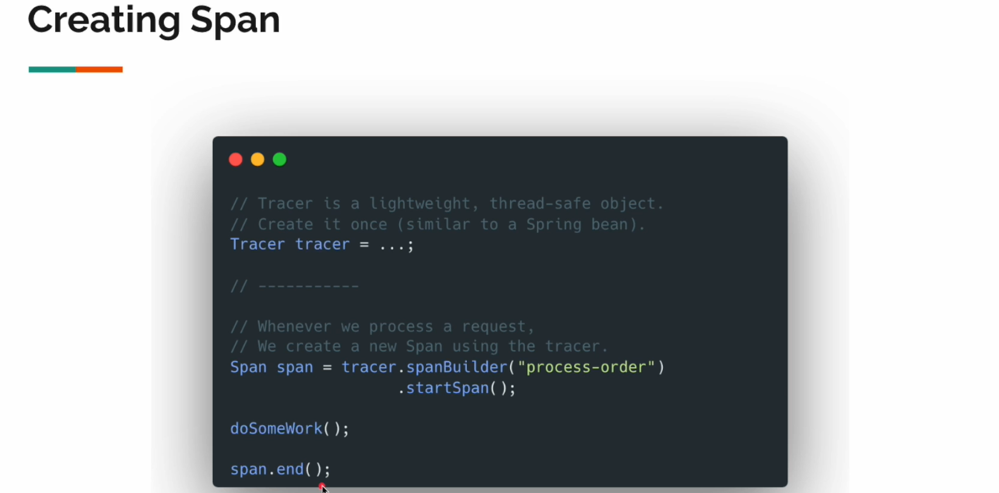

# manual-instrumentation

## Create span

When we invoke this end method, that time the spand object will tell the processor that "you can export me".

That time, the processor will send the span detail to the openTelemetry using the gRPC exporter.
